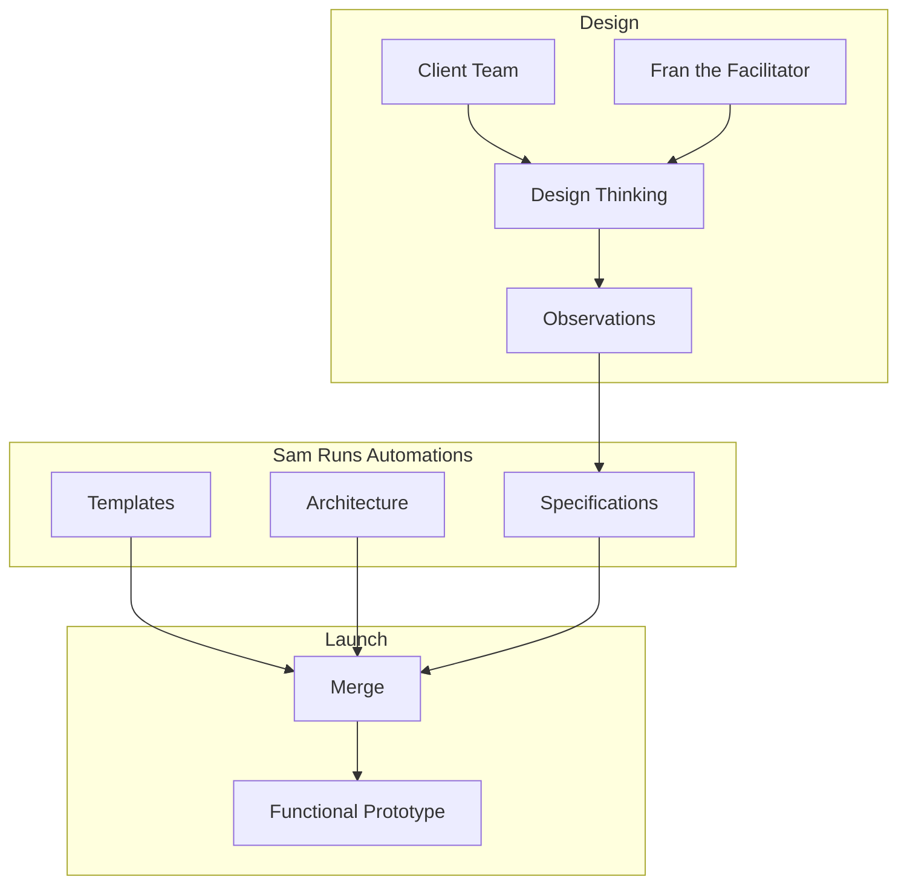

# [stage0](https://agile-learning.institute/stage0)

Stage0 is a team of Discord AI Bots that help you to Design, Build, and Run your Software as a Service platform. The name comes from rocketry, where stage Zero is the launch-pad that launches stage one, and the control center that operates missions. The stage0 software platform helps to launch new products, features, or services with built-in support for product launch, change management, operational observability, incident management and more. Let's meet the team:

- **SP** *the ?Salesperson?* lives here on the Stage0 Discord server. If you don't have a discord server for your product, they will help you get one setup. Then they can install the stage0 bot's onto your server to get things started. 

Once your server is setup, you will have access to the full team:
- **Fran** *the Facilitator* will guide Stage0 Design Workshops, that use human centered design techniques to capture design specifications for your product. 
- **Sam** *the SRE* will manage and execute Stage0 runbook automatons to provision cloud infrastructure, generate prototypes, deploy code and more. 
- **Ivan** *the SRE First Responder* staffs the customer support channel, monitors the site performance and availability to identify incidents, and manage incident responses.
- **SM** *the social media currator* will manage promotion of your product across multiple social media platforms. (integrations)
- **HR** *the Human Resources guru* manages HR functions (integration with HR product)
- **SC** *the Scrum Master* facilitates daily standup meetings and mananges a Kanban board (integrations?)
- **AD** *the marketing guru* manages SEO and Social ad spend and eMail marketing campaigns.

# How Fran works with Sam to Launch a Product

## Design
Through a series of design thinking workshops your team will use human-centered design exercises to identify the meaningful outcomes your product will provide, and design a solution to achieve those outcomes. This design is captured in a collection of design documents, referred to collectively as the Design Specifications. 
- Learn more about stage0 human-centered design techniques [here](./specifications/design-thinking.md). 
- Learn more about stage0 design specifications
    - see [here](./specifications/product.yaml) for product information.
    - see [here](./specifications/data_catalog.yaml) for the stage0 data catalog.

## Integration
The specifications harvested from the design thinking workshops are technology agnostic, describing the business problem and solution. During integration those specifications are mapped onto a specific architecture and technology stack. 
- Learn more about architecture specifications [here](./specifications/dictionaries/dd.specifications.yaml). 

## Launch
This is when the action get's exciting. This is where your design specifications become functional code. At T minus 0 we start code generation, and by T+1 hour your product will have "live" development and testing environments with a functional prototype. 
- Learn more about what a 80% prototype is [here](./specifications/launch-mvp.md). 
- Learn more about code generation [here](./specifications/launch-generate.md). 
- Learn more about deployment automation [here](./specifications/launch-infrastructure.md). 

