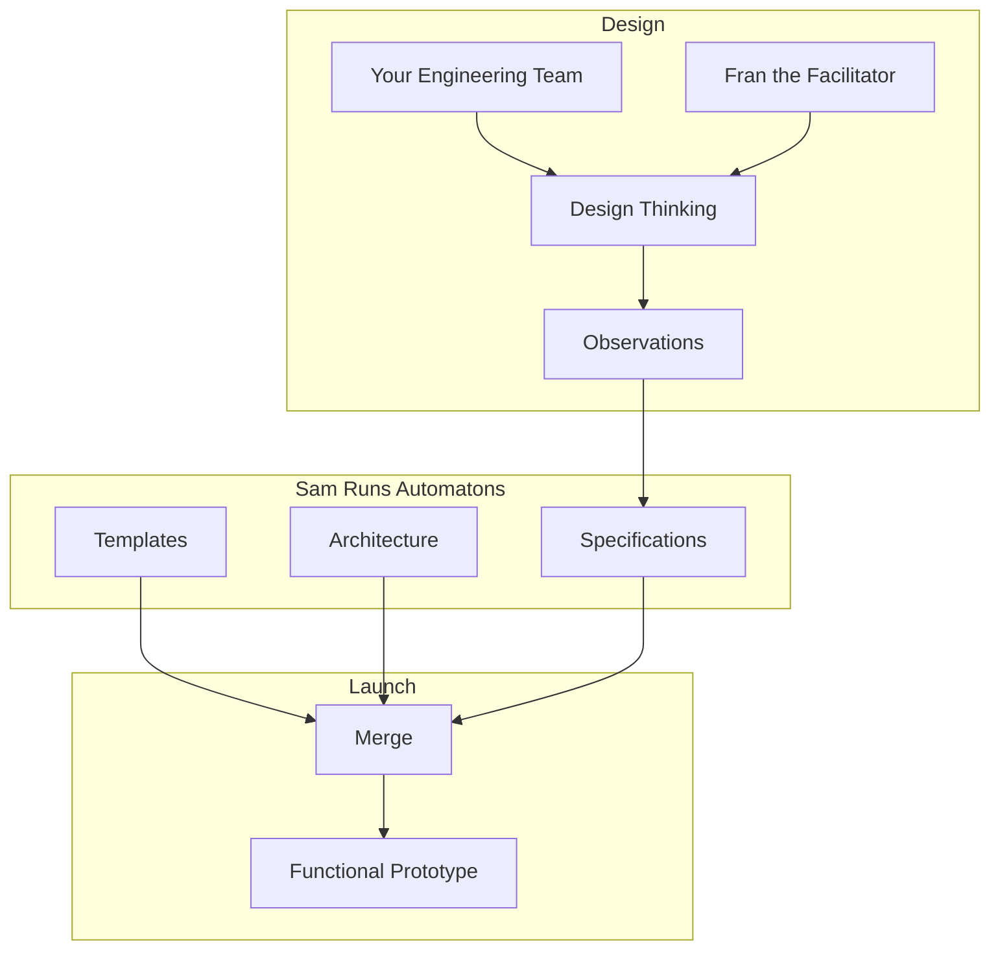

# [stage0](https://agile-learning.institute/stage0)

Stage0 is a collection of Discord AI Bots that help your engineering team to Design, Build, and Run your Software as a Service platform. The name comes from rocketry, where stage Zero is the launch-pad that launches stage one, and the control center that operates missions. The stage0 bots help to launch new products, features, or services with day-one support for automated deployment, change management, quality  control, observability, incident response and more. Let's meet the team:

- **[Json](./JSON.md)** *the customer service rep* lives here on the Stage0 Discord server, and he will help you get everything setup and configured. If you don't have a discord server for your product, Json will help you get one setup. Then they can install the stage0 bot's onto your server to get things started. Join our [Stage0 Discord Server](https://discord.gg/SzNTstqBH2) and open a direct message with @json to get started!

- **[Fran](./FRAN.md)** *the Facilitator* will guide Stage0 Design Workshops, that use human centered design techniques to capture design specifications for your product. 

- **[Sam](./SAM.md)** *the SRE* will manage and execute Stage0 runbook automatons to provision cloud infrastructure, generate prototypes, deploy code and more. 

# Product Launch
How Fran works with Sam to Launch a Product

## Design
Through a series of [stage0 design thinking workshops](DESIGN_THINKING.md) your team will use human-centered design techniques to identify the meaningful outcomes your product will provide, and design a solution to achieve those outcomes. This design is captured in a collection of technology agnostic design documents, referred to collectively as the products [Design Specifications](./SPECIFICATIONS.md). 

## Integration
The specifications harvested from the design thinking workshops are technology agnostic, describing the business problem and solution, not the technologies used. During integration those specifications are mapped onto a specific [architecture and technology stack](./ARCHITECTURE.md) that can be merged with template code to produce functional prototypes. 

## Launch
This is when the action get's exciting. This is where your design specifications become functional code. At T minus 0 Sam will execute a **run book** to start code generation, and by T plus 1 hour your product will have "live" development and testing [environments](./CHANGE.MD) with a functional prototype. 

# Futures
Ware are always looking to grow the stage0 feature set, and here are a few possible additions/integrations you may see in the future:
- **Susan** *the Scrum Master* facilitates daily standup meetings and manages a Kanban board to progress your product down it's product roadmap. (Jira/Trello integration?++)
- **Ivan** *the SRE First Responder* staffs the customer support channel, monitors the site performance and availability to identify incidents, and coordinates incident responses with your engineering team.
- **SM** *the social media curator* will manage promotion of your product across multiple social media platforms. 
- **HR** *the Human Resources guru* manages HR functions 
- **AD** *the marketing guru* manages marketing campagins
