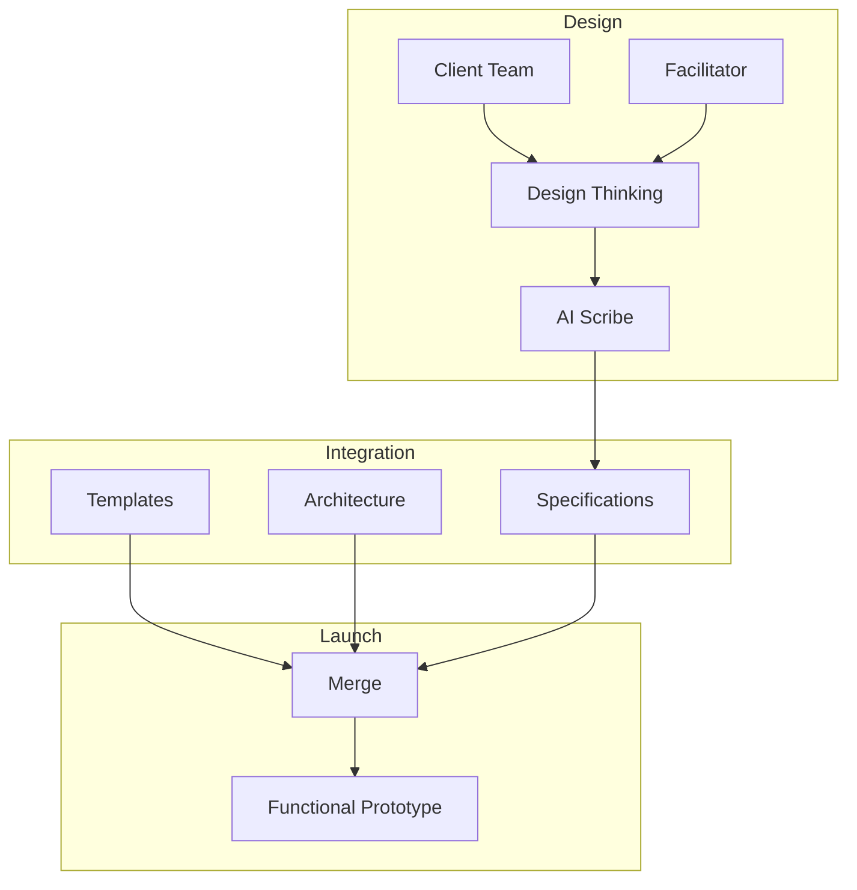

# [stage0](https://agile-learning.institute/stage0)

stage0 is a software platform that uses Artificial Intelligence and Human Centered Design techniques to capture design specifications in a technology agnostic manner, and then combines those specifications with a set of technology specific templates to generate a functional prototype that has 80% of the functionality needed to launch a MVP. The name comes from rocketry, where stage Zero is the launch-pad that launches stage one. The stage0 software platform helps to launch new products, features, or services in just a few weeks.

Learn about current status [here](./STATUS.md).

# How it works

## Design
Through a series of design thinking workshops your team will use human-centered design exercises to identify the meaningful outcomes your product will provide, and design a solution to achieve those outcomes. This design is captured in a collection of design documents, referred to collectively as the Design Specifications. 
- Learn more about stage0 human-centered design techniques [here](./specifications/design-thinking.md). 
- Learn more about stage0 design specifications
    - see [here](./specifications/product.yaml) for product information.
    - see [here](./specifications/data_catalog.yaml) for the stage0 data catalog.

## Integration
The specifications harvested from the design thinking workshops are technology agnostic, describing the business problem and solution. During integration those specifications are mapped onto a specific architecture and technology stack. 
- Learn more about architecture specifications [here](./specifications/dictionaries/dd.specifications.yaml). 

## Launch
This is when the action get's exciting. This is where your design specifications become functional code. At T minus 0 we start code generation, and by T+1 hour your product will have "live" development and testing environments with a functional prototype. 
- Learn more about what a 80% prototype is [here](./specifications/launch-mvp.md). 
- Learn more about code generation [here](./specifications/launch-generate.md). 
- Learn more about deployment automation [here](./specifications/launch-infrastructure.md). 

