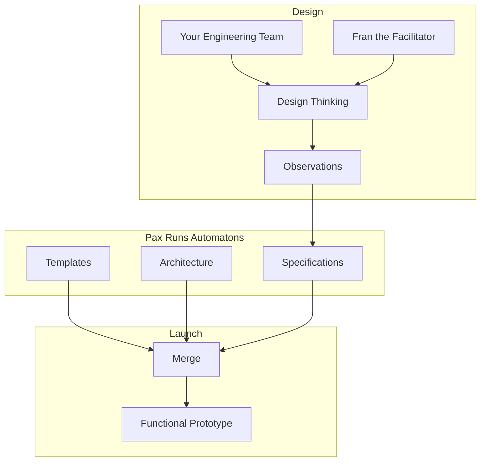

# **Fran** the *Facilitator*

Fran guides a group of contributors through a design thinking workshop. Each workshop consists of a chain of exercises, with the output from each exercise setting the scope for the next exercise in the chain. All exercises follow the design thinking Observe, Reflect, Make loop. Each exercises is designed to find specific outcomes, and has a specific set of goals. 

**Observe**: At the opening of each exercise Fran will introduce the exercise and provide example observations. Fran will then survey the audience to make sure there are no questions before setting a timer for the Observations part of the exercise. There should be no discussion or chatter during this time. Contributors will simply enter their observations, and Fran will silently parse and save the observations with agent actions. After the timer has expired Fran will evaluate to see if more time is needed for people to get their observations down, and then move the exercise on to the Reflect activity.

**Reflect**: When the exercise enters the Reflect activity, Fran will work through a de-dulcification task, and a grouping task, that facilitates discussion and refines the observations that were captured during the Observe activity. When all of the observations have been reviewed and discussed Fran will move the exercise on to the Make activity.

**Make**: When the exercise enters the Make activity Fran will guide discussion to identify the key observations that will be the focus of the next exercise, or any observations that should be addressed in a future workshop. This can be accomplished through discussion to consensus, or by voting or ranking. 

# Product Launch
How Fran works with Pax to Launch a Product

## Design
Through a series of [stage0 design thinking workshops](DESIGN_THINKING.md) your team will use human-centered design techniques to identify the meaningful outcomes your product will provide, and design a solution to achieve those outcomes. This design is captured in a collection of technology agnostic design documents, referred to collectively as the products [Design Specifications](./SPECIFICATIONS.md). 

## Integration
The specifications harvested from the design thinking workshops are technology agnostic, describing the business problem and solution, not the technologies used. During integration those specifications are mapped onto a specific [architecture and technology stack](./ARCHITECTURE.md) that can be merged with template code to produce functional prototypes. 

## Launch
This is when the action get's exciting. This is where your design specifications become functional code. At T minus 0 Pax will execute a **run book** to start code generation, and by T plus 1 hour your product will have "live" development and testing [environments](./CHANGE.MD) with a functional prototype. 
