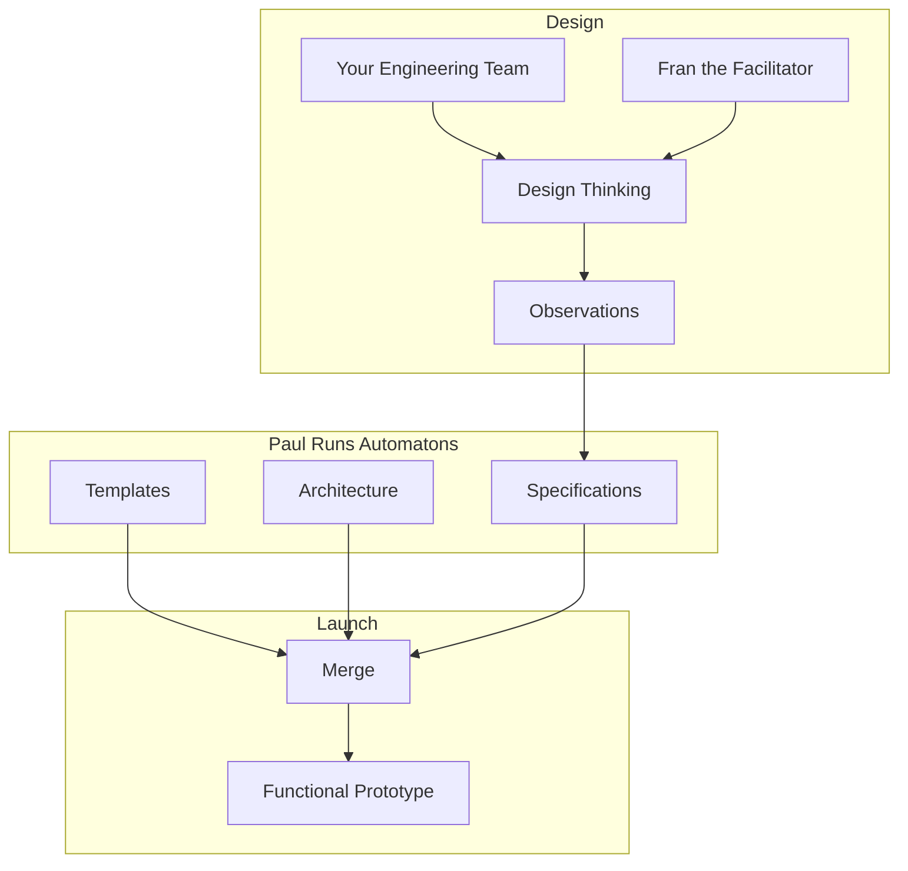

# Product Launch
How Fran works with Paul to Launch a Product Prototype

## Design
Through a series of [stage0 design thinking workshops](./STAGE0_THINKING.mdd) your team will use human-centered design techniques to identify the meaningful outcomes your product will provide, and design a solution to achieve those outcomes. This design is captured in a collection of technology agnostic design documents, referred to collectively as the [design specifications](../SPECIFICATIONS.md). 

## Integration
The observations harvested from the design thinking workshops are technology agnostic, describing the business problem and solution, not the technologies used. During integration those observations are mapped onto a specific architecture and technology stack as architecture specifications. 

## Launch
This is when the action get's exciting. This is where your design specifications become functional code. At T minus 0 Paul will execute a **Launch** automation run book to start code generation, and by T plus 1 hour your product will have "live" development and testing environments with a functional prototype deployed. 
