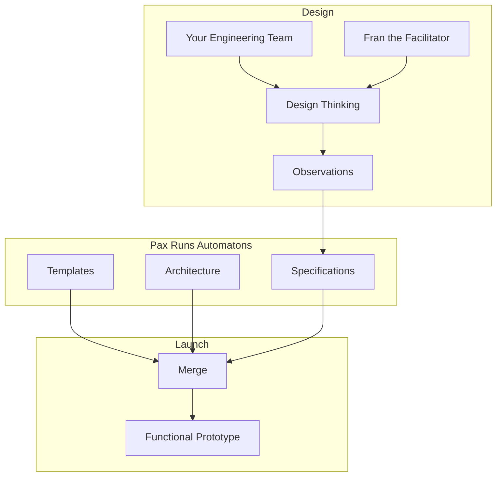

# **Pax** the *Product Manager*

Pax manages product releases. Pax can help map Fran's design specifications onto a deployment architecture. Pax also stores and executes runbooks to run automation's. The [Template Repo Processor](https://github.com/agile-learning-institute/stageZero-repo-processor) (the merge block below) is a prototype runbook. More thought is needed to structure runbooks, and workflows. Pax will have runbook, workflow, architecture, and template services. They will likely consume product and user info from Json, and system meta-data from Fran. Out of the box run books should support a target architecture change management process. 

# Product Launch
How Fran works with Pax to Launch a Product

## Design
Through a series of [stage0 design thinking workshops](DESIGN_THINKING.md) your team will use human-centered design techniques to identify the meaningful outcomes your product will provide, and design a solution to achieve those outcomes. This design is captured in a collection of technology agnostic design documents, referred to collectively as the products [Design Specifications](./SPECIFICATIONS.md). 

## Integration
The specifications harvested from the design thinking workshops are technology agnostic, describing the business problem and solution, not the technologies used. During integration those specifications are mapped onto a specific [architecture and technology stack](./ARCHITECTURE.md) that can be merged with template code to produce functional prototypes. 

## Launch
This is when the action get's exciting. This is where your design specifications become functional code. At T minus 0 Pax will execute a **run book** to start code generation, and by T plus 1 hour your product will have "live" development and testing [environments](./CHANGE.MD) with a functional prototype. 
