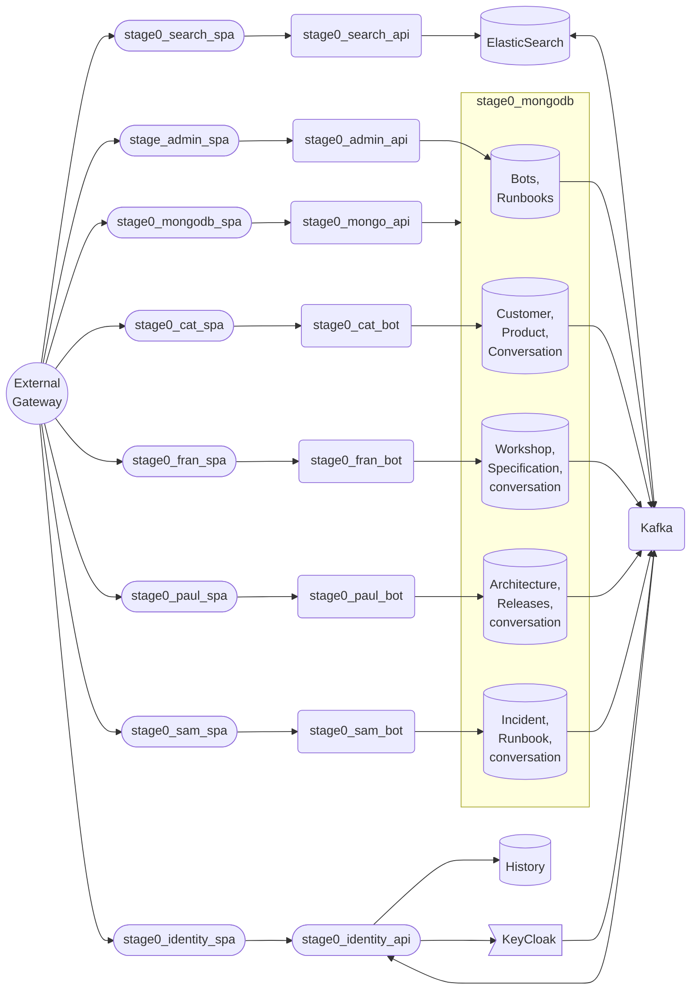
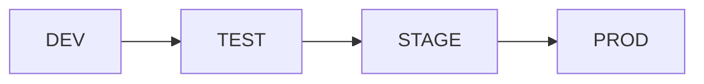

# stage0 Microservice Architecture

This is the architecture used by Stage0 and the first architecture supported by product launch services.

## Architecture principles. 
The stage0 architecture establishes a separation of concerns that supports engineering specialization. Data engineers are focused on Mongo DB, elastic search, Kafka eventual consistency configurations, and most importantly data quality. API engineers build the software that implements business logic and supports a single page application. The API engineers primary user is the SPA developer. The SPA developer is responsible for the user experience, and the user interface. They may duplicate some validation logic when it's necessary to improve the user experience. They consume only a single API.

#### See also
- [Service Granularity](./docs/service-granularity.md) standards
- [Service Observability](./docs/service-observability.md) standards
- [Service Configurability](./docs/service-configurability.md) standards

# Architecture Diagram

This diagram utilize the [mermaid flowchart library](https://mermaid.js.org/syntax/flowchart.html), you may need to install an IDE plugin to preview these diagrams. The VS Code extension markdown-mermaid is a good option.

## Infrastructure

The following diagram identifies the cloud infrastructure used by the stage0 platform.

TODO: Still TBD

### DEV

This is a cloud hosted development environment. CI Automation deploys new code directly into this environment. Backing services in this environment are based on containerized database resources which contain test data, and can return to the know starting point by redeploying the containers.

### TEST

This is a cloud hosted testing environment, where end-to-end testing is done to assure the quality of the system before release. This environment also uses containerized backing databases to support automated testing. Once the SQA team determines that the new release has passed quality checks in this environment it can be deployed into the Staging environment.

### STAGE

This is the final Pre-Production environment. In this environment data from the Production environment is replicated into the Staging environment to test database migrations. One last QA check is done in this environment before deploying the release into Production.

### PROD

This is the live production environment.