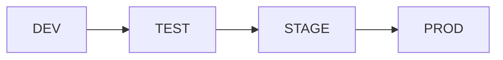

# stage0 Microservice Architecture

Stage0 is a cloud-native, containerized, poly-repo, loosely coupled, microservice implementation. 

## Table of Contents
- [Architecture Principles](#architecture-principles)
- [Service Granularity](#service-granularity)
- [Service Observability](#service-observability)
- [Service Configurability](#service-configurability)
- [Architecture Diagram](#architecture-diagram)
- [Infrastructure Diagram](#infrastructure)

## Architecture principles. 
The stage0 architecture establishes a separation of concerns that supports engineering specialization. Data engineers are focused on Mongo DB, elastic search, Kafka eventual consistency configurations, and most importantly data quality. API engineers build the software that implements business logic and supports a single page application. The API engineers primary user is the SPA developer. The SPA engineer is responsible for the user experience, and the user interface. They may duplicate some validation logic when it's necessary to improve the user experience. They consume only a single API.

## Service Granularity

### Core Principles

1. **User Focused Design**
   - Services align with user experiences.
   - Clear boundaries between services.
   - Independent deployment and scaling.

2. **Data Ownership**
   - Each service owns its data.
   - Services can read data from other services.
   - Read-Only data is available to a service in the database.
   - Asynchronous eventual consistency is a deployment option.

3. **Backing Services**
   - MongoDB 
   - ElasticSearch
   - Kafka
   - Kafka-Connect

4. **Domain Services**
   - MongoDB Configuration for Data and API engineers
   - Search service for All users
   - CAT Service for Customer Service personas
   - FRAN Service for Design Engineer personas
   - PAUL Service for Product Manager personas
   - SAM Service  for SRE personas
   - Identity Integration Service for Admin personas

### Asynchronous Communication

All cross domain communications occur across a Kafka service bus. One API should never call another API directly, and one SPA should only call one API. An API, like the identity API, can listen for updates to data from the user Data store to trigger integration functionality. 
- Kafka messaging
- Event-driven updates
- Kafka-Connect Event sourcing
- Change data capture for Search (future)

### Separation of concerns

#### Data layer
- Data quality constraints
- Data persistence at scale
- Query performance
- Eventual consistency

#### API Layer
- Business logic
- Roll based access control
- Complex data quality constraints

#### SPA layer
- User Experience
- Input validation 
- Error handling

## Service Observability

### API Observability

#### Health Endpoint

All APIs expose a `/health` endpoint that provides health status information. This endpoint supports Prometheus data collection, allowing for easy integration with monitoring systems.

#### Config Endpoint

All APIs expose a `/config` endpoint that provides information about the current configuration items and their sources. This is useful for debugging and understanding the runtime configuration of the service.

### SPA Observability

#### Nginx Server Logging

SPAs use the default configuration values for Nginx server logging. This includes access logs and error logs, which are useful for monitoring and debugging.

### BUILT_AT Versioning

All components (API, BOT, and SPA) are containerized for deployment, and expose (Through the /config endpoint or the /admin page) the BUILT_AT date-time stamp created when the container is built. 

## Service Configurability

### Config Singleton

All APIs use the `Config` singleton from the `stage0_py_utils` package. This ensures consistent configuration management across all services. For detailed implementation, see [config.py](https://github.com/agile-learning-institute/stage0_py_utils/blob/main/config.py).

### Configuration Sources

The config singleton loads configuration from multiple sources in the following order:

1. **Default Values**: Hardcoded defaults in the config singleton
2. **Environment Variables**: Override defaults with environment variables
3. **Configuration Files**: Override environment variables of the same name. Note that this means there is not a unified configuration file, rather all config values are loaded from discrete files. 

### Special Configuration Values

- **BUILT_AT**: This value is always loaded from a file generated by Docker Build in CI. It is not configurable via environment variables or configuration files.
- **CONFIG_FOLDER**: This environment variable can be used to change the location of all other config file values. By default, config files are loaded from The default directory for the runtime ``./``

## SPA Configuration

### Nginx Configuration

SPAs are served by Nginx containers with a configuration to proxy `/api/*` to the appropriate API. This uses Nginx configuration templating and the appropriate *_PORT environment variable.

## Architecture Diagram

This diagram utilize the [mermaid flowchart library](https://mermaid.js.org/syntax/flowchart.html), you may need to install an IDE plugin to preview these diagrams. The VS Code extension markdown-mermaid is a good option.

## Infrastructure

The following diagram identifies the cloud infrastructure used by the stage0 platform.

TODO: Still TBD

### DEV

This is a cloud hosted development environment. CI Automation deploys new code directly into this environment. Backing services in this environment are based on containerized database resources which contain test data, and can return to the know starting point by redeploying the containers.

### TEST

This is a cloud hosted testing environment, where end-to-end testing is done to assure the quality of the system before release. This environment also uses containerized backing databases to support automated testing. Once the SQA team determines that the new release has passed quality checks in this environment it can be deployed into the Staging environment.

### STAGE

This is the final Pre-Production environment. In this environment data from the Production environment is replicated into the Staging environment to test database migrations. One last QA check is done in this environment before deploying the release into Production.

### PROD

This is the live production environment.